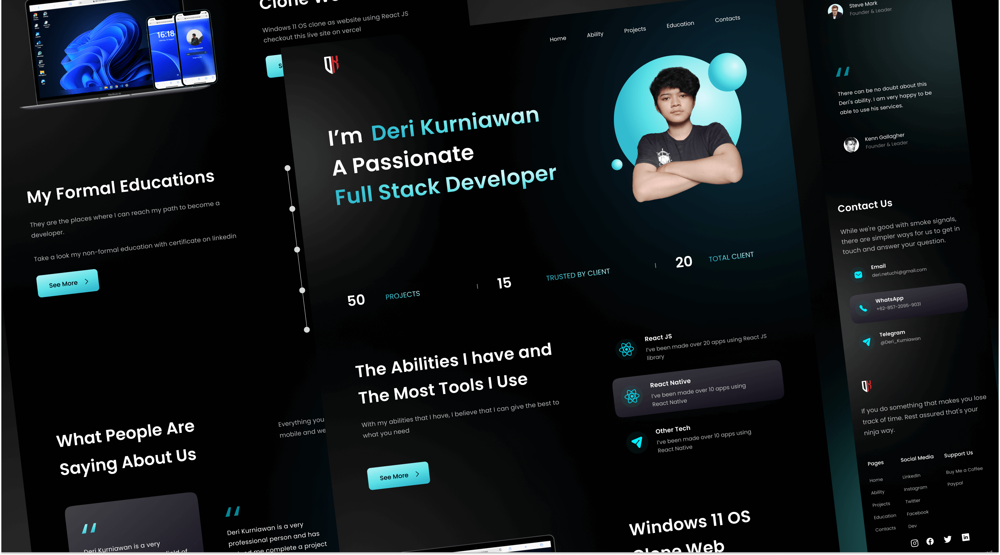

This is the first post on the Portfolio Blog. We will use this blog to share updates about the project, and to share our thoughts on the project.

I create this app to exploring Next JS, React JS and Docusaurus. I hope this app can help you to create your own portfolio website.

Bye the way this is portfolio documentation is created using Docusaurus. You can see the documentation [here](/docs/intro).

I'm so glad you're here. I hope you find some inspiration and ideas here. Feel free to leave a comment if you have any questions or ideas on [github issues](https://github.com/Deri-Kurniawan/portfolio/issues).
